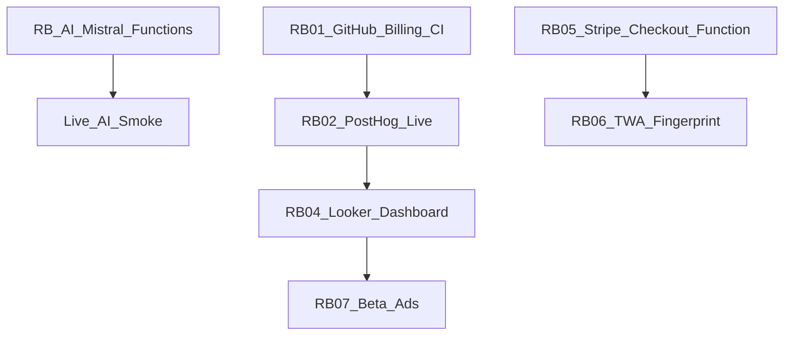

# Remaining backlog — po PROMPT-01..12 (100 %)

Stav (2026-08-27): **guest/offline produkcia na [forenz-detectiv.vercel.app](https://forenz-detectiv.vercel.app) je LIVE a smoke-overená.**  
Base44 AI backend (Mistral secret + 7 functions) je nasadený na appId `6a81f5e7f4adbf6a9523b9d8`. **RB-AI ostáva:** prepnúť Vercel `VITE_BASE44_APP_ID` na ten istý appId (+ auth origins) a overiť ostrý PDF/PNG upload. Stripe/TWA/Ads ostávajú deferred.

**Zámerné rozhodnutia (neotvárať znova):**

- Produkt **bez** demo/synthetic case (žiadne `loadDemoCase`, BA–KE CTA, `VITE_ENABLE_DEMO`)
- Graph / Sherlock systémové stringy ostávajú SK v tejto vlne
- Do `assetlinks.json` sa nedáva fake SHA-256 — len fingerprint z reálneho keystore
- Stripe / paywall **hard-disabled** — restore až v RB-05

**Ako použiť:** každý ticket nižšie skopíruj do GitHub Issue. `gh` CLI môže vyžadovať `gh auth login`.

**Pipeline (hotové v kóde):** upload → validate ≤50 MB → PDF page-chunking (`pdf_container` + `pdf_page`, max 40 strán) → `analyzeDocument` → contradictions. Polia `parent_document_id` / `page_number` / `page_count` / `source_kind` sú v `Document.jsonc` a **`base44 entities push` prebehlo** (PROMPT-OPS-01).

---

## ✅ Hotové (kód + produkčný guest/offline smoke)

| Oblasť | Stav |
|--------|------|
| Frontend deploy (Vercel) | [forenz-detectiv.vercel.app](https://forenz-detectiv.vercel.app) + alias `forenzdetectiv.vercel.app` |
| Upload PNG / TXT / PDF, client OCR, offline IndexedDB | ✅ (live smoke TXT PASS) |
| PDF page-chunking + progress / cancel / retry UI | ✅ |
| Demo/synthetic case odstránený | ✅ |
| Stripe / paywall hard-disabled | ✅ (UI bez Cenník) |
| PostHog wiring (8 eventov, RB-03) | ✅ kód + `disable_session_recording`; live key → **RB-02** |
| Master E2E (Playwright S01–S12) | ✅ |
| Lokálny CI gate (`npm test && lint && typecheck && build`) | ✅ |
| TWA scaffolding + PNG + docs | ✅ fingerprint → RB-06 |
| OG/Twitter metadata | ✅ forenz-detectiv.vercel.app |
| PROD smoke (PROMPT-PROD-SMOKE-01) | ✅ empty home, TXT, tabs, Air 420×912, dashboard back |

---

## ⏳ Vyžaduje vlastníka (nie je blokované kódom)

| ID | Oblasť | Čo treba |
|----|--------|----------|
| **RB-AI** | Mistral + functions | Backend DONE na `6a81f5e7…`; zostáva Vercel `VITE_BASE44_APP_ID` + auth origins + AI smoke |
| **RB-01** | GitHub Actions CI | Vyriešiť billing lock → re-enable workflow na `push` |
| **RB-02** | PostHog EU | `VITE_POSTHOG_KEY` (+ host) vo Vercel Production + redeploy |
| **RB-04** | Looker Studio | Dashboard po RB-02 |
| **RB-05** | Stripe monetizácia | Obnoviť client + secrets + `isMonetizationEnabled` (**po** ostrom AI teste) |
| **RB-06** | TWA / Play | Keystore SHA-256 → `assetlinks.json` |
| **RB-07** | Beta 100 + Ads | Growth ops |
| **—** | Custom doména | `forenzdetectiv.sk` — DNS + Vercel; aktuálne `.vercel.app` |

---

## Done vs Remaining (detailný prehľad)

| Oblasť | Stav | Poznámka |
|--------|------|----------|
| Debug HMR / WS probe | Done | HMR na `127.0.0.1`, bez ingestu |
| UTM + LeadCapture; MiniPlayground odstránený | Done | HomeHero = upload-first |
| Audit `logAction` + AuditLogViewer | Done | |
| PostHog 8 helperov + wiring | Done | |
| Onboarding QuickTip / non-blocking intro | Done | |
| PdfExportDialog, bulk ≤20, i18n shell SK/CS | Done | |
| `canCreateCase` + referral link capture | Done | `?ref=` → `forenz_incoming_ref` only; no auto Pro credit |
| TWA scaffolding + PNG + docs | Done | fingerprint = placeholder → RB-06 |
| Stripe fail-closed + `createCheckoutSession` | Paused | Client removed; backend kept → **RB-05** |
| Looker / Ads **docs** | Done | live dashboard → RB-04 / RB-07 |
| PDF page-chunking + Document schema push | Done | **PROMPT-OPS-01** |
| PDF chunk progress UI / cancel / per-page retry | Done | **PROMPT-PROD-01** |
| Demo production gate (`VITE_ENABLE_DEMO`) | Removed | Hard-delete demo case + CTA |
| Master E2E (Playwright S01–S12) | Done | upload-first (no demo bootstrap) |
| Lokálny CI gate | Done | focused + lint/typecheck/build |
| `trackContradictionDetected` mimo demo | Done | **RB-03** |
| Live guest smoke na Vercel | Done | **PROMPT-PROD-SMOKE-01** |
| Cloud AI (Pixtral) ostro | Partial | **RB-AI** — backend READY; Vercel appId switch |
| GitHub Actions zelený | Remaining | billing lock → **RB-01** |
| PostHog EU prod key | Remaining | **RB-02** |
| Looker North Star chart | Remaining | **RB-04** |
| Stripe `createCheckoutSession` | Paused | **RB-05** |
| assetlinks SHA-256 z keystore | Remaining | **RB-06** |
| Beta 100 + Ads ops | Remaining | **RB-07** |

---

## RB-AI — Mistral + functions deploy (blocks cloud AI ostro)

**Title:** `ops: point Vercel at owned Base44 app with Mistral + analyzeDocument`

**Why:** Secret + functions sú na `6a81f5e7f4adbf6a9523b9d8` (admin účet `youh4ck3dme@gmail.com`). Produkčný frontend stále môže volať staré `6a7ed366…` bez admin/secret prístupu.

**Acceptance:**

- [x] `MISTRAL_API_KEY` set (server-only) na `6a81f5e7…`
- [x] Functions deployed (`analyzeDocument`, `sherlockChat`, …)
- [ ] Vercel Production `VITE_BASE44_APP_ID=6a81f5e7f4adbf6a9523b9d8`
- [ ] Auth origins: `https://forenz-detectiv.vercel.app`, `https://forenzdetectiv.vercel.app`
- [ ] Ostrý upload PDF/PNG → analyzing → done s osobami/rozpormi (nie len client OCR)

**Owner hint:** Base44 dashboard / CLI. Nikdy `VITE_` prefix pre Mistral.

**Depends on:** Vercel env change (requested via environment setup)

---

## RB-01 — Unlock GitHub Actions billing + re-run CI

**Title:** `ops: unlock GitHub billing and get CI green on main`

**Why:** Actions job `test-lint-build` končí failure s 0 steps — účet je locked due to billing. Auto-run na push/PR je preto vypnutý (iba `workflow_dispatch`), aby nové commity na `main` neostali červené. Lokálny gate: `npm test && npm run lint && npm run typecheck && npm run build`.

**Acceptance:**

- [ ] Billing issue na GitHub účte vyriešený
- [ ] Workflow [`.github/workflows/ci.yml`](../.github/workflows/ci.yml) na `main` prebehne: test → lint → typecheck → build
- [ ] Posledný run na `main` má conclusion `success`

**Owner hint:** Account admin (GitHub Settings → Billing). Dev: po unlock re-run failed workflow alebo prázdny commit.

**Depends on:** nič

---

## RB-02 — PostHog EU live keys

**Title:** `ops: set VITE_POSTHOG_KEY for EU production analytics`

**Why:** Bez kľúča je analytika no-op — North Star (`contradiction_viewed`) sa v cloude nemeria.

**Acceptance:**

- [ ] `VITE_POSTHOG_KEY` (+ `VITE_POSTHOG_HOST=https://eu.i.posthog.com`) v prod / Base44 env
- [ ] Po uploade / `case_created` viditeľný event v PostHog EU Live
- [ ] Session recording ostáva vypnutá (súlad s [`src/lib/analytics.js`](../src/lib/analytics.js))

**Owner hint:** Product / DevOps. Referencia: [`docs/LOOKER_POSTHOG.md`](LOOKER_POSTHOG.md), [`.env.example`](../.env.example).

**Depends on:** RB-01 voliteľné (nezávislé od CI)

---

## RB-03 — Wire `trackContradictionDetected` on real detection ✅

**Title:** `fix(analytics): fire contradiction_detected on real detection`

**Why:** North Star funnel — overiť, že `trackContradictionDetected` beží po reálnej detekcii rozporov (upload-first, bez synthetic case).

**Acceptance:**

- [x] Po úspešnom `detectContradictions` / store update reálnych rozporov sa volá `trackContradictionDetected(count, hasAlibiConflict)` — `useForenzStore.setContradictions` + `fetchData` po cloude
- [x] `npm test` + lint/typecheck PASS; žiadne PII v properties

**Owner hint:** Frontend. Súbory: `useForenzStore.js`, handlery v `ForenzDetectiv.jsx` / contradiction engine callback.

**Depends on:** RB-02 (aby sa event dal overiť v PostHog; kód ide aj bez neho)

---

## RB-04 — Looker Studio North Star chart

**Title:** `ops: Looker Studio WAU contradiction_viewed + funnel`

**Why:** Docs existujú; chýba zdieľateľný dashboard pre Weekly Active Investigators.

**Acceptance:**

- [ ] Looker Studio data source napojený na PostHog EU (alebo BigQuery export)
- [ ] Scorecard: weekly unique users s eventom `contradiction_viewed`
- [ ] Funnel: `case_created` → `contradiction_detected` → `contradiction_viewed` → `pdf_exported`
- [ ] Zdieľateľný link (screenshot do repo **nie** povinný)

**Owner hint:** Growth / Analytics. Špec: [`docs/LOOKER_POSTHOG.md`](LOOKER_POSTHOG.md).

**Depends on:** RB-02

---

## RB-05 — Stripe re-enable (paused)

**Title:** `feat(stripe): restore client checkout after monetization pause`

**Why:** Monetization is hard-disabled for clean production testing (`isMonetizationEnabled = false`, `src/lib/stripe.js` removed, paywall UI not rendered). Backend [`createCheckoutSession`](../base44/functions/createCheckoutSession/entry.ts) remains. Restore client + ops before charging users.

**Acceptance:**

- [ ] Restore Stripe client (`src/lib/stripe.js` or equivalent) + CSP Stripe domains
- [ ] Set `isMonetizationEnabled = true` and re-wire PricingModal / PaywallGate / AppBar
- [ ] `VITE_STRIPE_PUBLIC_KEY` + Base44 `STRIPE_SECRET_KEY` in production
- [ ] Plan upgrade only after verified payment (webhook / success handler)
- [ ] Update [`docs/STRIPE_SETUP.md`](STRIPE_SETUP.md)

**Owner hint:** Backend + Frontend + ops. Secrets v Base44, nie v gite.

**Depends on:** Stripe účet (business). Kód nezávisí od RB-01.

---

## RB-06 — TWA upload-key SHA-256

**Title:** `ops(twa): replace assetlinks placeholder with keystore SHA-256`

**Why:** [`public/.well-known/assetlinks.json`](../public/.well-known/assetlinks.json) má `REPLACE_WITH_UPLOAD_KEY_SHA256`. Play / Digital Asset Links bez fingerprintu neprejde.

**Acceptance:**

- [ ] Keystore / Bubblewrap upload key existuje
- [ ] SHA-256 vložený do `assetlinks.json` (formát `AA:BB:…`)
- [ ] Na produkcii `/.well-known/assetlinks.json` → 200
- [ ] Digital Asset Links verification OK (Chrome / Play)

**Owner hint:** Mobile / Release. Kroky: [`docs/TWA_SETUP.md`](TWA_SETUP.md). PNG ikony a `android/twa-manifest.json` už sú.

**Depends on:** RB-05 nie je tvrdé; prakticky po Play signing. Nezávisí od PostHog.

---

## RB-07 — Beta 100 + Ads ops

**Title:** `ops: segmented beta 100 + SK/CZ Google Ads UTM checklist`

**Why:** Growth mimo kódu — overiť funnel s reálnymi investigátormi a atribúciu cez UTM.

**Acceptance:**

- [ ] Zoznam / segment ~100 beta (LEA, advokáti, investigátori) s invite flow
- [ ] Landing URL s UTM podľa [`docs/GOOGLE_ADS.md`](GOOGLE_ADS.md)
- [ ] Overené: `lead_captured` / `case_created` v PostHog s `utm_source`
- [ ] Kampane SK/CZ checklist (brand + intent + negatives) — **spend a kill-CPI = business rozhodnutie**, nie kódový DoD

**Owner hint:** Founder / Growth. Tech depends: RB-02 (meranie), ideálne RB-04.

**Depends on:** RB-02; odporúčané RB-04

---

## Referencie

| Doc | Účel |
|-----|------|
| [LOOKER_POSTHOG.md](LOOKER_POSTHOG.md) | 8 eventov, North Star, Looker |
| [GOOGLE_ADS.md](GOOGLE_ADS.md) | UTM + kampane SK/CZ |
| [STRIPE_SETUP.md](STRIPE_SETUP.md) | Test vs live Stripe |
| [TWA_SETUP.md](TWA_SETUP.md) | Bubblewrap, assetlinks, Play |
| [todo.md](todo.md) | Historický katalóg PROMPT-01..12 (nemazať / neprepisovať statusy tu) |

